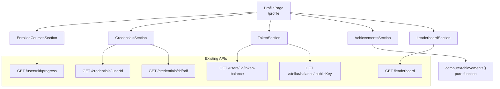

# Design Document: Student Profile Page with Achievements

## Overview

This feature expands the existing `/profile` page into a comprehensive learning journey dashboard. The current page handles profile editing and wallet linking. We add five new sections — Enrolled Courses, Credentials, Token & Wallet, Achievements, and Leaderboard — all fetched in parallel on mount.

The implementation is entirely frontend-side. No new backend endpoints are required; all data is available through existing APIs.

---

## Architecture



Key design decisions:

- **Parallel data fetching**: `Promise.allSettled` is used so that one failing API call does not block other sections from rendering.
- **Section-level error isolation**: Each section manages its own loading/error state independently.
- **Pure achievement computation**: `computeAchievements` is a pure function that takes progress records, credentials, and BST balance as inputs and returns a list of badge states. This makes it trivially testable without any mocking.
- **No new Zustand stores**: Profile data is local component state. The profile page is not a high-frequency re-render target, so global state is unnecessary overhead.
- **Reuse existing UI primitives**: `Card`, `Badge`, `Skeleton`, `CircularProgress`, and `ProgressBar` components are already available and will be used throughout.

---

## Components and Interfaces

### Updated `ProfilePage`

**File:** `apps/frontend/src/app/profile/page.tsx`

The existing page is refactored to add the five new sections. Data for all sections is fetched in parallel via `Promise.allSettled` inside a single `useEffect`.

```typescript
interface ProfileData {
  progress: ProgressRecord[];
  credentials: CredentialRecord[];
  tokenBalance: string | null;
  stellarBalances: StellarBalance[] | null;
  leaderboard: LeaderboardEntry[];
}
```

### `EnrolledCoursesSection`

**File:** `apps/frontend/src/app/profile/EnrolledCoursesSection.tsx`

```typescript
interface EnrolledCoursesSectionProps {
  progress: ProgressRecord[];
  courses: Record<string, { id: string; title: string }>;
  loading: boolean;
  error: boolean;
  onRetry: () => void;
}
```

Renders a list of course cards with `CircularProgress` and a progress bar. Completed courses show a trophy icon and "Completed" badge.

### `CredentialsSection`

**File:** `apps/frontend/src/app/profile/CredentialsSection.tsx`

```typescript
interface CredentialsSectionProps {
  credentials: CredentialRecord[];
  loading: boolean;
  error: boolean;
  onRetry: () => void;
}
```

Renders credential cards with course name, issue date, txHash (truncated with a Stellar explorer link), and a PDF download button.

### `TokenSection`

**File:** `apps/frontend/src/app/profile/TokenSection.tsx`

```typescript
interface TokenSectionProps {
  stellarPublicKey?: string;
  tokenBalance: string | null;
  stellarBalances: StellarBalance[] | null;
  loading: boolean;
  error: boolean;
}
```

Shows BST balance prominently. Lists recent Stellar account balance entries (asset code, balance). If no wallet is linked, shows a prompt pointing to the existing WalletSection.

### `AchievementsSection`

**File:** `apps/frontend/src/app/profile/AchievementsSection.tsx`

```typescript
interface AchievementsSectionProps {
  badges: BadgeState[];
}
```

Renders a grid of badge cards. Earned badges are fully colored; unearned badges are grayscale with a lock icon.

### `LeaderboardSection`

**File:** `apps/frontend/src/app/profile/LeaderboardSection.tsx`

```typescript
interface LeaderboardSectionProps {
  leaderboard: LeaderboardEntry[];
  userId: string;
  stellarPublicKey?: string;
  loading: boolean;
  error: boolean;
}
```

Finds the student's entry in the leaderboard array and displays their rank and balance. If not found, shows an "unranked" message.

### `computeAchievements` Pure Function

**File:** `apps/frontend/src/app/profile/computeAchievements.ts`

```typescript
interface AchievementInput {
  credentialCount: number;
  bstBalance: number;       // parsed from string
  progressRecords: ProgressRecord[];
}

interface BadgeState {
  id: string;
  name: string;
  description: string;
  earned: boolean;
}

function computeAchievements(input: AchievementInput): BadgeState[]
```

All badge logic lives here. The five badges are:

| Badge ID | Name | Condition |
|---|---|---|
| `first-step` | First Step | `credentialCount >= 1` |
| `course-collector` | Course Collector | `credentialCount >= 5` |
| `token-earner` | Token Earner | `bstBalance > 0` |
| `high-achiever` | High Achiever | `bstBalance >= 500` |
| `dedicated-learner` | Dedicated Learner | any `progressRecord` has `progressPct > 0 && progressPct < 100` |

---

## Data Models

### `ProgressRecord`

```typescript
interface ProgressRecord {
  id: string;
  courseId: string;
  progressPct: number; // 0–100
  updatedAt: string;
}
```

Source: `GET /users/:id/progress`

### `CredentialRecord`

```typescript
interface CredentialRecord {
  id: string;
  courseId: string;
  txHash: string | null;
  stellarPublicKey: string | null;
  issuedAt: string;
  course?: { id: string; title: string };
}
```

Source: `GET /credentials/:userId`

### `StellarBalance`

```typescript
interface StellarBalance {
  asset_code?: string;   // undefined for native XLM
  asset_type: string;
  balance: string;
}
```

Source: `GET /stellar/balance/:publicKey` (returns `account.balances` array)

### `LeaderboardEntry`

```typescript
interface LeaderboardEntry {
  userId: string;
  username: string | null;
  email: string;
  stellarPublicKey: string;
  balance: string;
}
```

Source: `GET /leaderboard`

### `BadgeState`

```typescript
interface BadgeState {
  id: string;
  name: string;
  description: string;
  earned: boolean;
}
```

Computed client-side by `computeAchievements`.

---

## Correctness Properties

*A property is a characteristic or behavior that should hold true across all valid executions of a system — essentially, a formal statement about what the system should do. Properties serve as the bridge between human-readable specifications and machine-verifiable correctness guarantees.*

---

**Property 1: Progress display correctness**

*For any* list of progress records, each record with `progressPct === 100` must render a "Completed" indicator, and each record with `progressPct < 100` must render a progress bar whose width attribute equals `progressPct`.

**Validates: Requirements 1.2, 1.3**

---

**Property 2: Credential card completeness**

*For any* list of credentials, each rendered credential card must contain the course name (or fallback), the formatted issue date, and — when `txHash` is non-null — a link whose `href` contains the `txHash` value.

**Validates: Requirements 2.2, 2.4**

---

**Property 3: Transaction display completeness**

*For any* list of Stellar balance entries, each rendered row must display the asset code (or "XLM" for native) and the balance string.

**Validates: Requirements 3.4**

---

**Property 4: Credential-count badge correctness**

*For any* `credentialCount` in `[0, ∞)`, `computeAchievements` must return `first-step.earned === (credentialCount >= 1)` and `course-collector.earned === (credentialCount >= 5)`.

**Validates: Requirements 4.2, 4.3**

---

**Property 5: BST balance badge correctness**

*For any* `bstBalance` in `[0, ∞)`, `computeAchievements` must return `token-earner.earned === (bstBalance > 0)` and `high-achiever.earned === (bstBalance >= 500)`.

**Validates: Requirements 4.4, 4.5**

---

**Property 6: In-progress badge correctness**

*For any* list of progress records, `computeAchievements` must return `dedicated-learner.earned === true` if and only if at least one record has `progressPct > 0 && progressPct < 100`.

**Validates: Requirements 4.6**

---

**Property 7: Badge locked/unlocked rendering**

*For any* list of `BadgeState` values, each badge where `earned === false` must render with a locked visual indicator, and each badge where `earned === true` must render with the badge name and description visible.

**Validates: Requirements 4.7, 4.8**

---

**Property 8: Leaderboard rank computation**

*For any* leaderboard array and any `userId`, the displayed rank must equal `index + 1` where `index` is the position of the entry with matching `userId` in the array, or show "unranked" if no entry matches.

**Validates: Requirements 5.2, 5.3**

---

**Property 9: computeAchievements always returns all 5 badges**

*For any* valid `AchievementInput`, `computeAchievements` must return an array of exactly 5 `BadgeState` objects with distinct `id` values.

**Validates: Requirements 4.1**

---

## Error Handling

| Scenario | Behaviour |
|---|---|
| `GET /users/:id/progress` fails | EnrolledCoursesSection shows error message + retry button; other sections unaffected |
| `GET /credentials/:userId` fails | CredentialsSection shows error message + retry button; other sections unaffected |
| `GET /users/:id/token-balance` fails | TokenSection shows "—" balance and error indicator |
| `GET /stellar/balance/:publicKey` fails | TokenSection shows balance section without transaction list |
| `GET /leaderboard` fails | LeaderboardSection shows error indicator; other sections unaffected |
| `GET /credentials/:id/pdf` fails | Toast error message; download button re-enabled |
| No Stellar wallet linked | TokenSection and LeaderboardSection show wallet-link prompts |
| Course title not found for a progress record | Display fallback text `Course {courseId}` |

---

## Testing Strategy

**Testing framework:** Vitest + React Testing Library (already configured).

**Property-based testing library:** `fast-check` — TypeScript-first PBT library. Each property test runs a minimum of 100 iterations.

### Unit Tests

- `computeAchievements` with zero credentials, zero balance, empty progress
- `computeAchievements` with exactly 1 credential (First Step earned, Course Collector not)
- `computeAchievements` with exactly 5 credentials (both credential badges earned)
- `computeAchievements` with balance = 0, 1, 499, 500
- `computeAchievements` with all in-progress courses (Dedicated Learner earned)
- `computeAchievements` with all completed courses (Dedicated Learner not earned)
- EnrolledCoursesSection renders empty state when progress list is empty
- CredentialsSection renders empty state when credentials list is empty
- TokenSection renders wallet-link prompt when `stellarPublicKey` is undefined
- LeaderboardSection renders unranked message when userId not in leaderboard
- ProfilePage redirects unauthenticated users (via ProtectedRoute)

### Property-Based Tests

Each property test is tagged: **Feature: student-profile-achievements, Property N: {property_text}**

| Property | Generator | Assertion |
|---|---|---|
| Property 1 | `fc.array(fc.record({ progressPct: fc.integer({min:0, max:100}), ... }))` | completed indicator XOR progress bar per record |
| Property 2 | `fc.array(fc.record({ txHash: fc.option(fc.hexaString()), ... }))` | required fields present; txHash link conditional |
| Property 3 | `fc.array(fc.record({ asset_code: fc.option(fc.string()), balance: fc.string() }))` | asset label and balance present in each row |
| Property 4 | `fc.nat()` for credentialCount | badge earned flags match threshold conditions |
| Property 5 | `fc.nat()` for bstBalance | badge earned flags match threshold conditions |
| Property 6 | `fc.array(fc.record({ progressPct: fc.integer({min:0, max:100}) }))` | dedicated-learner earned iff any in-progress record |
| Property 7 | `fc.array(fc.record({ earned: fc.boolean(), ... }))` | locked/unlocked CSS class matches earned flag |
| Property 8 | `fc.array(fc.record({ userId: fc.uuid(), ... }))` + `fc.uuid()` | rank = index+1 or unranked |
| Property 9 | `fc.record({ credentialCount: fc.nat(), bstBalance: fc.nat(), progressRecords: fc.array(...) })` | always returns exactly 5 distinct badges |
