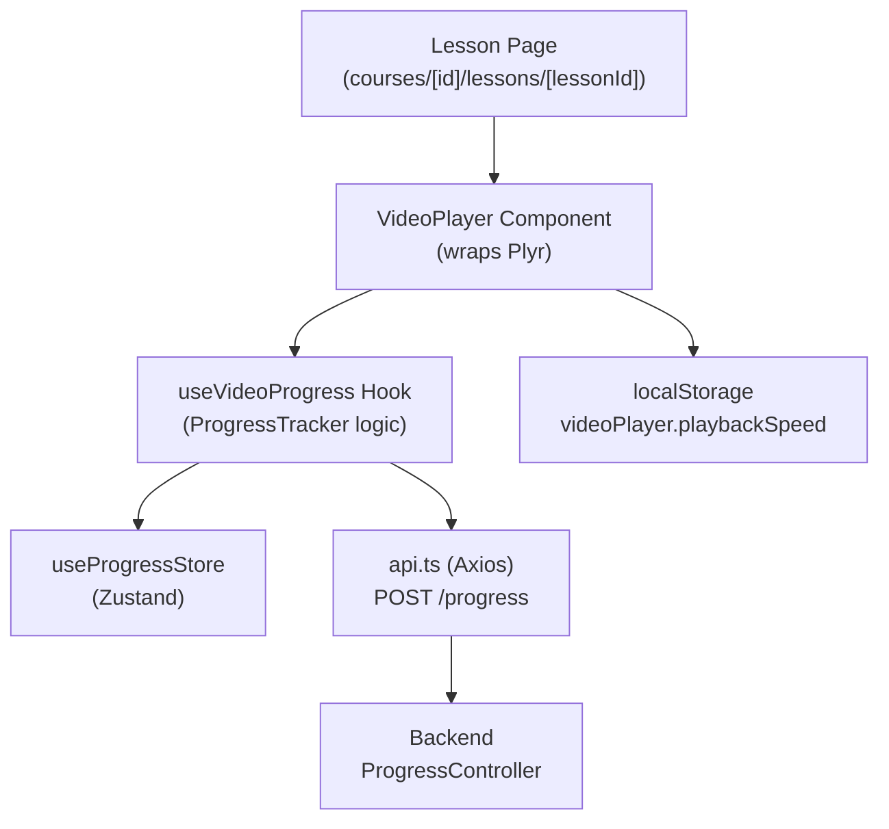

# Design Document: Video Player with Progress Tracking

## Overview

This feature adds a custom video player component to lesson content pages. It wraps [Plyr](https://plyr.io/) — a lightweight, accessible HTML5 media player — and integrates with the existing backend progress API (`POST /progress`) and the Zustand `useProgressStore`. The player supports MP4 and HLS sources, playback speed controls, Picture-in-Picture (PiP), and keyboard shortcuts.

The implementation is entirely frontend-side. No backend changes are required; the existing `POST /progress` endpoint already accepts `courseId`, `lessonId`, and `progressPct`.

---

## Architecture



**Key design decisions:**

- **Plyr over Video.js**: Plyr is smaller (~25 KB gzipped), has first-class TypeScript types, and integrates cleanly with React via a `useRef` + `useEffect` pattern. Video.js is heavier and more suited to broadcast use cases.
- **Custom hook for progress logic**: `useVideoProgress` isolates all tracking, debouncing, and retry logic from the UI component, making both independently testable.
- **Debounce via `setInterval`**: A 10-second interval fires while the video is playing. On pause/unmount the interval is cleared and a final flush is sent.
- **Retry with exponential-ish backoff**: Up to 2 retries with a 2-second delay, implemented with `setTimeout` chains. Non-fatal on final failure.

---

## Components and Interfaces

### `VideoPlayer` Component

**File:** `apps/frontend/src/components/courses/VideoPlayer.tsx`

```typescript
interface VideoPlayerProps {
  courseId: string;
  lessonId: string;
  src: string;           // MP4 URL or HLS .m3u8 URL
  type?: 'video/mp4' | 'application/x-mpegURL';
  poster?: string;       // Optional thumbnail
  captions?: CaptionTrack[];
  initialProgressPct?: number; // Restored from store on mount
  onComplete?: () => void;
}

interface CaptionTrack {
  src: string;
  srclang: string;
  label: string;
  default?: boolean;
}
```

**Responsibilities:**
- Mount/destroy Plyr instance via `useRef` + `useEffect`
- Render error state when `src` is absent
- Render loading indicator while Plyr initialises
- Expose PiP toggle button (conditionally on browser support)
- Render keyboard shortcut help icon/popover
- Delegate all progress tracking to `useVideoProgress`
- Persist/restore playback speed via `localStorage`

### `useVideoProgress` Hook

**File:** `apps/frontend/src/hooks/useVideoProgress.ts`

```typescript
interface UseVideoProgressOptions {
  courseId: string;
  lessonId: string;
  onComplete?: () => void;
}

interface UseVideoProgressReturn {
  handleTimeUpdate: (currentTime: number, duration: number) => void;
  handlePause: (currentTime: number, duration: number) => void;
  handleEnded: () => void;
}
```

**Responsibilities:**
- Compute `progressPct` from `currentTime / duration`
- Debounce API calls to at most once per 10 seconds
- Flush immediately on pause/unmount
- Retry failed requests up to 2 times
- Update `useProgressStore` on success
- Call `onComplete` when `progressPct === 100`

### `usePlaybackSpeed` Hook

**File:** `apps/frontend/src/hooks/usePlaybackSpeed.ts`

```typescript
const SPEED_OPTIONS = [0.5, 0.75, 1, 1.25, 1.5, 2] as const;
type PlaybackSpeed = typeof SPEED_OPTIONS[number];

interface UsePlaybackSpeedReturn {
  speed: PlaybackSpeed;
  setSpeed: (speed: PlaybackSpeed) => void;
  speedOptions: readonly PlaybackSpeed[];
}
```

Reads/writes `localStorage` key `videoPlayer.playbackSpeed`. Defaults to `1`.

---

## Data Models

### Progress API Request (existing)

```typescript
// POST /progress
interface RecordProgressDto {
  courseId: string;   // UUID
  lessonId?: string;  // UUID (optional per backend DTO)
  progressPct: number; // integer 0–100
}
```

### Progress Store Entry (existing, extended)

The existing `LessonProgress` in `useProgressStore` tracks `completed` boolean. The video player will call `markLesson` when `progressPct === 100` and will read `progressPct` from the store to compute the initial seek position.

The store's `LessonProgress` interface will be extended:

```typescript
interface LessonProgress {
  lessonId: string;
  completed: boolean;
  completedAt?: string;
  progressPct?: number; // NEW: last known watch percentage
}
```

The `markLesson` action will be extended to also accept `progressPct`:

```typescript
markLesson: (courseId: string, lessonId: string, completed: boolean, progressPct?: number) => void;
```

### localStorage Schema

```
Key:   "videoPlayer.playbackSpeed"
Value: "0.5" | "0.75" | "1" | "1.25" | "1.5" | "2"
```

---

## Correctness Properties

*A property is a characteristic or behavior that should hold true across all valid executions of a system — essentially, a formal statement about what the system should do. Properties serve as the bridge between human-readable specifications and machine-verifiable correctness guarantees.*

---

**Property 1: progressPct computation is correct for all valid inputs**

*For any* `currentTime` in `[0, duration]` and `duration > 0`, `computeProgressPct(currentTime, duration)` must equal `Math.round(currentTime / duration * 100)` and be clamped to `[0, 100]`.

**Validates: Requirements 2.1**

---

**Property 2: Retry count is exactly 3 total attempts on persistent failure**

*For any* progress update where the backend consistently returns a non-2xx response, the `ProgressTracker` SHALL make exactly 3 total API calls (1 initial + 2 retries) before giving up.

**Validates: Requirements 2.4**

---

**Property 3: Store is updated with latest progressPct after successful response**

*For any* `progressPct` value in `[0, 100]`, after a successful `POST /progress` response, `useProgressStore.getState().progress[courseId]` SHALL contain an entry for `lessonId` with the matching `progressPct`.

**Validates: Requirements 2.5**

---

**Property 4: Initial seek position matches stored progressPct**

*For any* stored `progressPct` in `[0, 100]` and video `duration > 0`, the VideoPlayer SHALL set `currentTime` to `(progressPct / 100) * duration` on mount.

**Validates: Requirements 2.6**

---

**Property 5: Seek keyboard shortcuts clamp to valid range**

*For any* `currentTime` in `[0, duration]`, pressing ArrowRight SHALL result in `min(duration, currentTime + 10)` and pressing ArrowLeft SHALL result in `max(0, currentTime - 10)`.

**Validates: Requirements 5.2, 5.3**

---

**Property 6: Volume keyboard shortcuts clamp to [0, 1]**

*For any* `volume` in `[0, 1]`, pressing ArrowUp SHALL result in `min(1, volume + 0.1)` (rounded to 1 decimal) and pressing ArrowDown SHALL result in `max(0, volume - 0.1)`.

**Validates: Requirements 5.4, 5.5**

---

**Property 7: Playback speed localStorage round-trip**

*For any* speed in `{0.5, 0.75, 1, 1.25, 1.5, 2}`, setting the speed SHALL persist it to `localStorage["videoPlayer.playbackSpeed"]`, and a subsequent mount SHALL restore that exact speed.

**Validates: Requirements 3.4, 3.5**

---

**Property 8: All interactive controls have ARIA labels**

*For any* rendered `VideoPlayer`, every interactive element (buttons, sliders) SHALL have a non-empty `aria-label` or `aria-labelledby` attribute.

**Validates: Requirements 6.1**

---

**Property 9: Invalid video URL always shows error state**

*For any* string that is not a valid HTTP/HTTPS URL (empty string, null-ish, malformed), the VideoPlayer SHALL render an element with `role="alert"` containing a non-empty error message.

**Validates: Requirements 1.2**

---

## Error Handling

| Scenario | Behaviour |
|---|---|
| `src` is empty or missing | Render error message; do not mount Plyr |
| Plyr fails to load source | Plyr's native `error` event triggers error state |
| `POST /progress` returns non-2xx | Retry up to 2 times; silently fail after 3rd attempt |
| `requestPictureInPicture()` throws | Catch and log; do not crash the player |
| `localStorage` read/write throws | Catch and fall back to default speed (1×) |
| `duration` is 0 or NaN | Skip progress computation; do not send API call |

---

## Testing Strategy

**Testing framework:** Vitest + React Testing Library (already configured in the project).

**Property-based testing library:** [`fast-check`](https://github.com/dubzzz/fast-check) — a mature TypeScript-first PBT library. Each property test runs a minimum of 100 iterations.

### Unit Tests

Focus on specific examples, edge cases, and integration points:

- VideoPlayer renders with valid `src`
- VideoPlayer renders error state with missing `src`
- VideoPlayer renders loading indicator during initialisation
- `onComplete` callback fires when video ends
- PiP button visible when `document.pictureInPictureEnabled === true`
- PiP button hidden when `document.pictureInPictureEnabled === false`
- Captions toggle button present when `captions` prop is provided
- Space key toggles play/pause
- `f` key toggles fullscreen
- `m` key toggles mute
- Help icon renders keyboard shortcut reference

### Property-Based Tests

Each property test is tagged with the format: **Feature: video-player-progress-tracking, Property N: {property_text}**

| Property | Test description |
|---|---|
| Property 1 | `fc.float` for currentTime/duration → verify formula |
| Property 2 | Mock API to always fail → assert call count === 3 |
| Property 3 | `fc.integer({min:0, max:100})` for progressPct → assert store updated |
| Property 4 | `fc.integer({min:0, max:100})` for progressPct + `fc.float` for duration → assert seek position |
| Property 5 | `fc.float` for currentTime/duration → assert clamped seek result |
| Property 6 | `fc.float({min:0, max:1})` for volume → assert clamped volume result |
| Property 7 | `fc.constantFrom(...SPEED_OPTIONS)` → assert localStorage round-trip |
| Property 8 | Render VideoPlayer → assert all interactive elements have aria-label |
| Property 9 | `fc.string()` filtered to invalid URLs → assert error state rendered |
