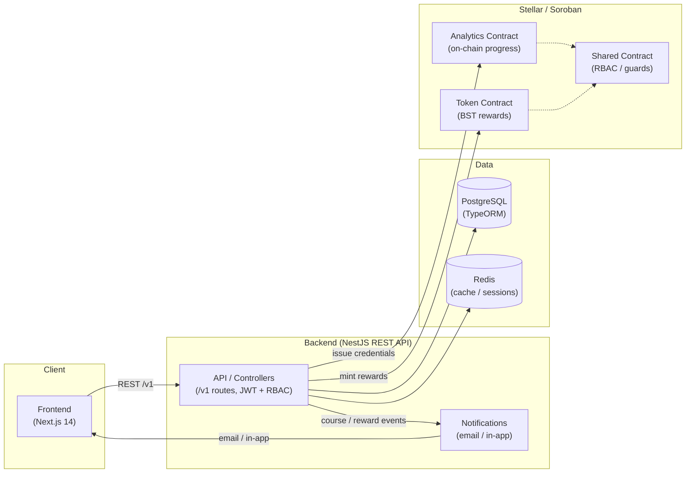

# scoopdope ..... good luck ...
y


> A blockchain education platform built on the **Stellar network**, delivering verifiable on-chain credentials and token-based learning incentives.

---

## Overview

scoopdope is a full-stack, monorepo education platform that leverages the Stellar blockchain to issue tamper-proof credentials when learners complete courses. It is a rebranded and extended fork of the StrellerMinds project by [StarkMindsHQ](https://github.com/StarkMindsHQ), adapted for a broader scoopdope and vocational training audience.

The platform combines a modern web frontend, a scalable REST API backend, and a suite of Soroban smart contracts — all living in a single monorepo for streamlined development and deployment.

## Architecture

The diagram below shows how the main components of scoopdope interact: the frontend, the REST API, the PostgreSQL database, the Stellar/Soroban blockchain layer, and the notification subsystem.



**Component responsibilities:**

| Component | Role |
|---|---|
| Frontend | Next.js 14 app; wallet integration and learner UI |
| API | NestJS REST API exposing `/v1` routes with JWT auth and role guards |
| Database | PostgreSQL via TypeORM for users, courses, and enrollments |
| Blockchain | Soroban contracts on Stellar for credentials, progress, and token rewards |
| Notifications | Emits email / in-app notifications on course and reward events |

> Full diagram with data-flow annotations: [`docs/architecture.md`](./docs/architecture.md)

---

## Monorepo Structure

```
scoopdope/
├── apps/
│   ├── frontend/          # Next.js 14 web application (TypeScript)
│   └── backend/           # NestJS REST API (TypeScript)
├── contracts/
│   ├── analytics/         # On-chain progress tracking (Rust/Soroban)
│   ├── token/             # Reward token contract (Rust/Soroban)
│   └── shared/            # RBAC & shared utilities (Rust/Soroban)
├── scripts/               # Build and deploy scripts
├── docs/                  # Extended documentation
│   ├── production-deployment-guide.md # Production deployment & mainnet guide
│   ├── api-error-codes.md # API numeric error codes reference
│   ├── api-versioning.md
│   ├── api-rate-limiting.md
│   ├── community-moderation.md
│   ├── catastrophic-recovery.md
│   ├── kyc-verification.md
│   └── contract-abi.md    # Soroban contract ABI reference
├── .github/workflows/     # CI/CD pipelines
├── Cargo.toml             # Rust workspace
├── package.json           # Node.js workspace root
└── .env.example           # Environment variable template
```

---

## Tech Stack

### Frontend (`apps/frontend`)
| Technology | Purpose |
|---|---|
| Next.js 14 (App Router) | React framework with SSR/SSG |
| TypeScript | Type safety |
| Tailwind CSS | Utility-first styling |
| Zustand | Lightweight state management |
| Axios | HTTP client |
| @stellar/stellar-sdk | Stellar wallet integration |

### Backend (`apps/backend`)
| Technology | Purpose |
|---|---|
| NestJS | Scalable Node.js framework |
| TypeScript | Type safety |
| PostgreSQL + TypeORM | Relational database & ORM |
| JWT + Passport | Authentication & authorization |
| Swagger/OpenAPI | Auto-generated API docs |
| @stellar/stellar-sdk | Blockchain credential issuance |
| Redis | Caching & session management |

### Smart Contracts (`contracts/`)
| Technology | Purpose |
|---|---|
| Rust | Contract language |
| Soroban SDK | Stellar smart contract framework |
| Stellar CLI | Deployment & interaction |
| wasm32 target | WebAssembly compilation |

---

## Features

### Platform
- **Course Management** — Browse, enroll in, and complete structured blockchain courses
- **On-Chain Credentials** — Certificates issued as Stellar transactions upon course completion
- **Token Rewards** — Earn scoopdope tokens (BST) for completing modules and courses
- **Progress Tracking** — Real-time on-chain progress stored via the Analytics contract
- **Role-Based Access** — Admin, Instructor, and Student roles enforced on-chain via RBAC

### Smart Contracts
- **Analytics Contract** — Records per-student, per-course progress percentages on-chain
- **Token Contract** — Mints reward tokens to students upon verified course completion
- **Shared Contract** — Provides RBAC, reentrancy guards, and common validation utilities
- **Upgradeable Contracts** — Admin-authorized WASM replacement via the shared upgrade mechanism

### API
- RESTful endpoints for auth, courses, users, and Stellar interactions
- Interactive Swagger docs at `/api/docs`
- JWT-secured routes with role guards

---

## Getting Started

Follow these steps to run scoopdope locally.

### Prerequisites

| Tool | Version |
|---|---|
| Node.js | v18 or higher |
| npm | v9 or higher |
| PostgreSQL | v12 or higher |
| Rust | v1.75 or higher |
| Stellar CLI | v21.5.0 |
| Docker | Optional (for local Stellar testnet) |

### 1. Clone the repository

```bash
git clone https://github.com/your-org/scoopdope.git
cd scoopdope
```

### 2. Set up environment variables

```bash
cp .env.example .env
# Edit .env with your database credentials, JWT secret, and Stellar keys
```

### 3. Install Node.js dependencies

```bash
npm install
```

### 4. Start the backend

```bash
npm run dev:backend
# API available at http://localhost:3000
# Swagger docs at http://localhost:3000/api/docs
```

### 5. Start the frontend

```bash
npm run dev:frontend
# App available at http://localhost:3001
```

### 6. Build smart contracts

```bash
# Install Rust wasm target first
rustup target add wasm32-unknown-unknown

# Build all contracts
./scripts/build.sh
```

## Docker Setup

Containerized development and production environment for backend + PostgreSQL + Redis.

### Quick Start with Docker

```bash
# 1. Copy environment template
cp .env.example .env

# 2. Edit .env (JWT_SECRET, STELLAR_SECRET_KEY, etc.)
#    Note: DATABASE_HOST=postgres, DATABASE_USERNAME=scoopdope, etc. are auto-set

# 3. Start services (production mode)
docker compose up -d --build backend postgres redis

# Production API: http://localhost:3000/api
# Swagger docs: http://localhost:3000/api/docs

# Development (with hot reload):
# docker compose up -d --build  # Uses docker-compose.override.yml automatically

# Logs:
docker compose logs -f backend

# Stop & clean volumes:
docker compose down -v
```

**Key Notes:**
- **Default DB**: `scoopdope` db/user/pass (override in `.env`)
- **Dev Mode**: Auto hot-reload via src/ mount + `nest start --watch`
- **Persistence**: `postgres_data` / `redis_data` volumes
- **Healthchecks**: Backend waits for DB ready
- Frontend/contracts run separately (npm/yarn)

> For full production setup, Docker orchestration, and Stellar mainnet configuration, see [`docs/production-deployment-guide.md`](./docs/production-deployment-guide.md).

---

## Smart Contract Deployment

```bash
# Deploy to testnet
./scripts/deploy.sh testnet analytics

# Deploy to mainnet
./scripts/deploy.sh mainnet token
```

Requires `STELLAR_SECRET_KEY` set in your environment.

---

## Smart Contract ABI

The Soroban contracts expose a public interface (ABI) that the backend and Stellar CLI use to invoke them. Each contract function is documented inline with Rust doc comments (`///`) covering its parameters and return type, and the full interface is catalogued in the ABI reference.

| Contract | Function | Parameters | Returns |
|---|---|---|---|
| Analytics | `record_progress` | `student: Address`, `course_id: Symbol`, `progress: u32` | `()` |
| Analytics | `get_progress` | `student: Address`, `course_id: Symbol` | `u32` |
| Token | `mint_reward` | `to: Address`, `amount: i128` | `()` |
| Token | `balance` | `owner: Address` | `i128` |
| Shared | `grant_role` | `admin: Address`, `account: Address`, `role: Symbol` | `()` |
| Shared | `has_role` | `account: Address`, `role: Symbol` | `bool` |

> Full ABI reference with argument types, return values, and invocation examples: [`docs/contract-abi.md`](./docs/contract-abi.md)

---

## Environment Variables

See `.env.example` for the full list. Key variables:

| Variable | Description |
|---|---|
| `DATABASE_HOST` | PostgreSQL host |
| `DATABASE_NAME` | Database name (default: `scoopdope`) |
| `JWT_SECRET` | Secret for signing JWT tokens |
| `STELLAR_SECRET_KEY` | Stellar account secret for credential issuance |
| `STELLAR_NETWORK` | `testnet` or `mainnet` |
| `NEXT_PUBLIC_API_URL` | Backend API URL for the frontend |

---

## API Endpoints

All API endpoints are prefixed with `/api/v1` for versioning.

| Method | Path | Description |
|---|---|---|
| POST | `/api/v1/auth/register` | Register a new user |
| POST | `/api/v1/auth/login` | Login and receive JWT |

| GET | `/api/v1/courses` | List all published courses |
| GET | `/api/v1/courses/:id` | Get a single course |
| GET | `/api/v1/users/:id` | Get user profile |
| GET | `/api/v1/stellar/balance/:publicKey` | Get Stellar account balances |

**Interactive API Documentation:**
- Local: `http://localhost:3000/api/docs`
- Production: [https://nonso-eze.github.io/scoopdope/](https://nonso-eze.github.io/scoopdope/)
- Error Codes Reference: [`docs/api-error-codes.md`](./docs/api-error-codes.md)

**Versioning Policy:**
All routes use the `/v1` prefix. For details on breaking-change rules, the deprecation timeline (90-day sunset window), header-based version negotiation, and migration examples, see [`docs/api-versioning.md`](./docs/api-versioning.md).

---

## License

This project is licensed under the MIT License - see the [LICENSE](./LICENSE) file for details.

---

## CI/CD

GitHub Actions workflows in `.github/workflows/` run on every push and PR:

- **Backend**: install → build → test → lint
- **Frontend**: install → build → lint
- **Contracts**: `cargo test` → `cargo fmt --check` → `cargo clippy`
- **API Docs**: auto-deploy Swagger UI to GitHub Pages on push to `main`
- **Release**: semantic versioning via release-please, auto-generated `CHANGELOG.md`

---

## Contributing

See [CONTRIBUTING.md](./CONTRIBUTING.md) for the full contributing guide, including:

- Development environment setup
- Branching conventions (`feature/`, `fix/`, `chore/`, `docs/`, `test/`)
- Commit message format (Conventional Commits)
- How to run backend, frontend, and contract test suites
- Pull-request review process

Quick summary:

1. Fork the reposi

*Built with ❤️ on the Stellar network. Inspired by [StrellerMinds](https://github.com/StarkMindsHQ) by StarkMindsHQ.*

## Handsoff notes

<!-- handsoff-issue-1009 -->
- #1009: Nested resource URLs are inconsistent
<!-- handsoff-issue-984 -->
- #984: Course completion percentage calculation is incorrect

<!-- handsoff-issue-975 -->
- #975: BST rewards not rolled back on course unenrollment

<!-- handsoff-issue-977 -->
- #977: Wallet creation does not store public key in DB

<!-- handsoff-issue-1011 -->
- #1011: DELETE endpoints return 200 instead of 204

<!-- handsoff-issue-1012 -->
- #1012: Query parameter injection not sanitized

<!-- handsoff-issue-1025 -->
- #1025: No database indexes on foreign keys
